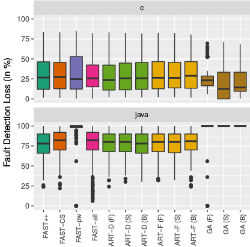
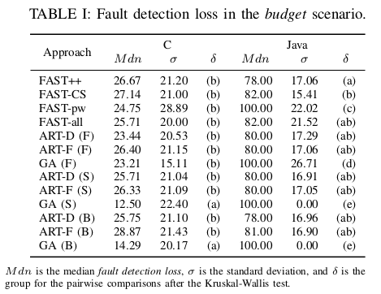
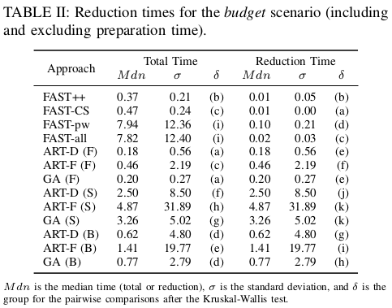
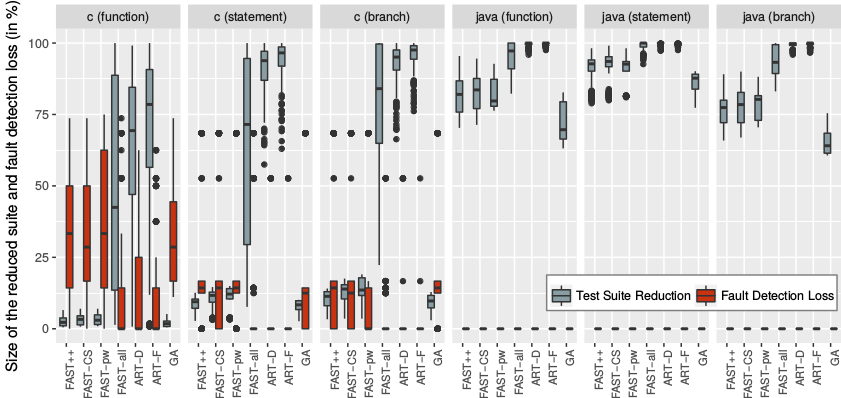
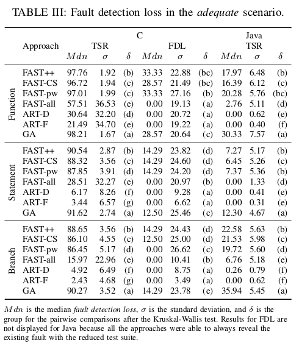
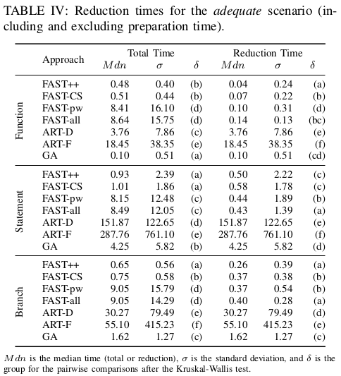
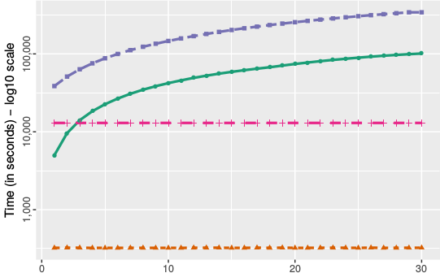
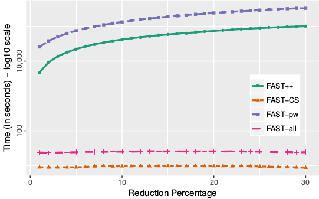
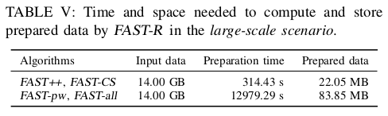

Experiment Results
----------------

### Raw data
Here you can find the raw data used in our statistical analysis.

 - Data used for evaluating the effectiveness (fault detection loss) and efficiency (time) of the proposed approach in the **inadequate (budget) scenario**: 
 -- [data_inadequate_D4J_function.tsv](data_inadequate_D4J_function.tsv)
 -- [data_inadequate_D4J_statement.tsv](data_inadequate_D4J_statement.tsv)
 -- [data_inadequate_D4J_branch.tsv](data_inadequate_D4J_branch.tsv)
 -- [data_inadequate_SIR_function.tsv](data_inadequate_SIR_function.tsv)
 -- [data_inadequate_SIR_statement.tsv](data_inadequate_SIR_statement.tsv)
 -- [data_inadequate_SIR_branch.tsv](data_inadequate_SIR_branch.tsv)
 - Data used for evaluating the effectiveness (test suite reduction/fault detection loss) and efficiency (time) of the proposed approach in the **adequate scenario**: 
 -- [data_adequate_D4J_function.tsv](data_adequate_D4J_function.tsv)
 -- [data_adequate_D4J_statement.tsv](data_adequate_D4J_statement.tsv)
 -- [data_adequate_D4J_branch.tsv](data_adequate_D4J_branch.tsv)
 -- [data_adequate_SIR_function.tsv](data_adequate_SIR_function.tsv)
 -- [data_adequate_SIR_statement.tsv](data_adequate_SIR_statement.tsv)
 -- [data_adequate_SIR_branch.tsv](data_adequate_SIR_branch.tsv)
 - Data used for evaluating the approach in the **large-scale scenario**: 
 --[data_large_scale.tsv](data_large_scale.tsv)
 
---
### The inadequate (budget) scenario
Fault Detection Loss for the test suite reduction approaches (in %):

Fault Detection Loss in the inadequate (budget) scenario:

Reduction times for the budget scenario (including and excluding preparation time):

---
### The adequate scenario
Test Suite Reduction and Fault Detection Loss in the adequate scenario:

Fault detection loss in the adequate scenario:

Reduction times for the adequate scenario (including and excluding preparation time):

---
### The large-scale scenario
Time required to reduce 500k test cases to different reduction targets:

Time and space needed to compute and store prepared data by FAST-R in the large-scale scenario:

